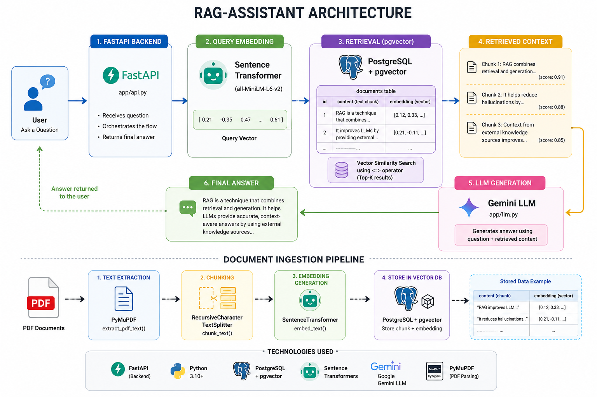

# Local RAG Assistant

A Retrieval-Augmented Generation (RAG) assistant built with:

- FastAPI
- PostgreSQL + pgvector
- Sentence Transformers
- Google Gemini
- Semantic Search

## Features

- PDF document ingestion
- Recursive chunking
- Embedding generation
- Vector similarity search
- Context-aware question answering

## Architecture

User Query --> Embedding Model --> PostgreSQL + pgvector --> Top-K Retrieval --> Gemini LLM --> Answer Generation

## Workflow:

1. ***Document Ingestion Phase***

* **Upload PDF Documents** : The system reads PDF documents containing the knowledge base using  **PyMuPDF** .
* **Extract Text** : Text is extracted from each page of the PDF and prepared for further processing.
* **Split into Chunks**  : The extracted text is divided into smaller overlapping chunks using **RecursiveCharacterTextSplitter** to maintain context across chunks.
* **Generate Embeddings** : Each text chunk is converted into a dense vector representation using the  **Sentence Transformer model (all-MiniLM-L6-v2)**.
* **Store in Vector Database** : The text chunks and their corresponding embeddings are stored in **PostgreSQL with pgvector** for efficient semantic search and retrieval.

2. ***Question Answering Phase***

* **User Submits a Question** : The user enters a natural language query through the Streamlit/FastAPI interface.
* **Generate Query Embedding** :The same embedding model converts the user's question into a vector representation.
* **Perform Vector Similarity Search :** pgvector compares the query embedding against stored document embeddings and retrieves the most relevant document chunks based on semantic similarity.
* **Build Context-Aware Prompt** : The retrieved document chunks are combined with the user's question to construct a context-rich prompt for the LLM.
* **Generate Response with Gemini** : The **Gemini LLM** processes the prompt and generates an answer grounded in the retrieved document context.
* **Return Final Answer** : The generated answer, along with the retrieved supporting sources, is presented to the user through the application interface.

## Run

1. pip install -r requirements.txt
3. python -m scripts.ingest_pdf data/sample.pdf
4. uvicorn app.api:app --reload
